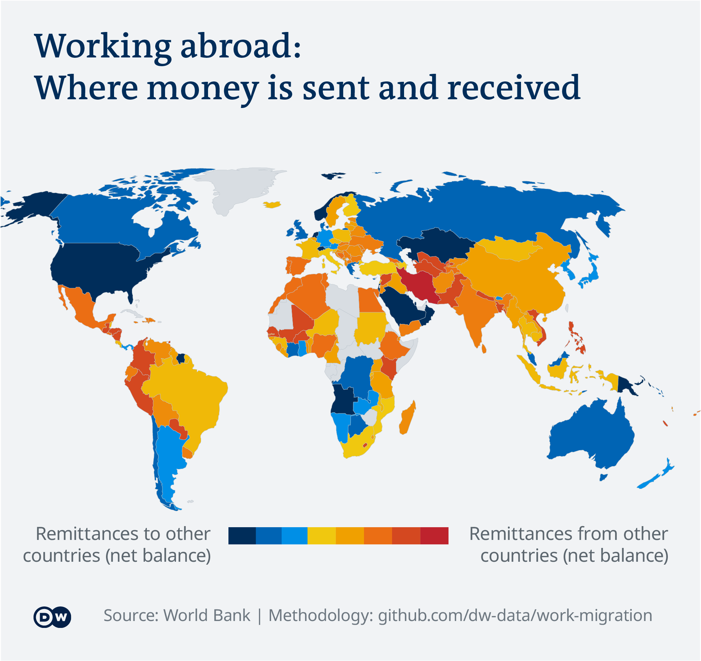

# Work Migration

_Idea:_  [Michel Penke](https://michelpenke.de)\
_Research, data analysis and data visualization:_  [Michel Penke](https://michelpenke.de)\
_Illustration:_ [Michel Penke](https://michelpenke.de)\
_Writing:_  [Michel Penke](https://michelpenke.de)

**Read the full articles on DW.com:**
- [XXX](https://www.dw.com/en/xxx)

Over the course of the Corona pandemic, just about every country in the world imposed travel restrictions to stop the spread of the virus. Especially hard hit by the restrictions are migrant workers, who have lost their jobs in many places due to lockdowns and have lost the ability to travel between their home and work countries due to travel bans. The analysis is devoted to the economic consequences of the pandemic for migrant workers. 

The following text will explain the process behind this story: Which data sources were used, how the analysis was conducted and how the data was visualized.

# Source data

| **Data** | **Source** | **Link** |
| --- | --- | --- |
| CoronaNet data collection | CoronaNet Project| [Data](https://www.coronanet-project.org)  |
| Personal remittances, recieved | World Bank | [Data](https://data.worldbank.org/indicator/BX.TRF.PWKR.CD.DT) |
| Personal remittances, paid | World Bank | [Data](https://data.worldbank.org/indicator/BM.TRF.PWKR.CD.DT) |
| Immigrants’ labour market outcomes  | OECD Libary | [Data](https://www.oecd-ilibrary.org/sites/29f23e9d-en/1/3/1/index.html?itemId=/content/publication/29f23e9d-en&_csp_=a9da7d4f182770aaa63ad86232529333&itemIGO=oecd&itemContentType=book#section-d1e10989) |

# Analysis
### Remittances flow

To show the geographically varying importance of labor migration and remittances, the ratio of payments paid and received per country was put into perspective and the ratios were then normalized. Since the values were more scattered in the area of received payments, the color scaling was increased by one unit. 

### Remittances
Für die Grafik der Rücküberweisungen wurde auf die Zahlen der Weltbank zugegriffen und die Anteile der Weltregionen berechnet. 

_Caveats: The World Bank's figures for remittances received and paid are not entirely congruent. The difference is explained by the imprecision of the collection method, which requires the World Bank to draw on data from a large number of banks and central banks with varying methodological standards and varying degrees of measurement accuracy. For presentation purposes, this imprecision has been ignored and the sum of funds received and transferred has been normalized and equated at 100 percent._

### Unemployment
For the visualization of the "employment gap", the unemployment data of the native population and those of labor migrants were put into relation. This made it possible to compare data from countries with very different unemployment rates, since the "employment gap" is a relative ratio independent of the absolute rate. 

Seasonal fluctuations were not removed from the unemployment figures. However, the historical presentation should make the viewer aware of this and counteract any distortion. 

### Restrictions
The chart of global travel restrictions is based on data from the CoronaNet Project, which compiles the number and types of anti-covid measures. The analysis filtered out measures that had nothing to do with restricting mobility as well as those that reduced mobility restrictions. The remainder were presented on a day-by-day basis. 

_Caveats: It should be noted here that there was no qualitative assessment of the constraints. A nationwide "hard" lockdown with the threat of punishment was evaluated in exactly the same way as a partial and "soft" one that, for example, only froze certain regions of a country and imposed, but did not enforce, a quarantine._
